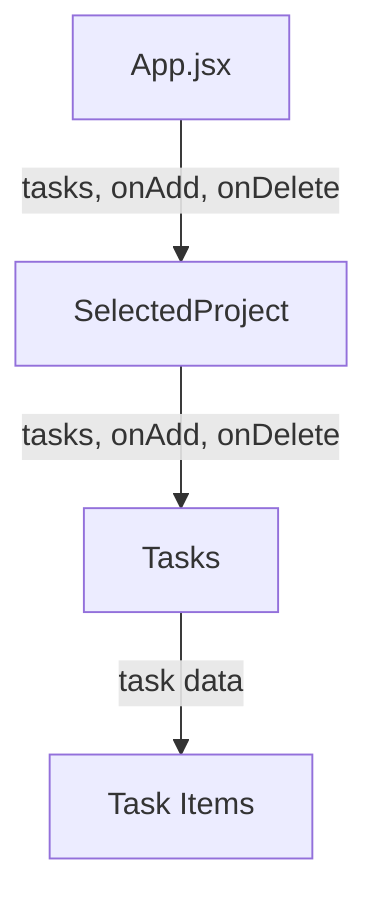

# Task State Management in React: From Projects to Tasks

## Table of Contents
1. [State Management Patterns](#state-management-patterns)
2. [Project vs Task Implementation](#project-vs-task-implementation)
3. [Task Data Flow Through Components](#task-data-flow)
4. [UI Implementation](#ui-implementation)
5. [Component Integration](#component-integration)

## State Management Patterns

### Project Creation: Understanding the Base Pattern
```jsx
function handleAddProject(projectData) {
  setProjectState((prevState) => {
    const projectId = Math.random();
    const newProject = {
      ...projectData,     // 📄 Spread project data
      id: projectId       // 🔑 Add unique ID
    };
    return {
      ...prevState,                              // 🔄 Keep existing state
      selectedProjectId: undefined,              // 🔲 Reset selection
      projects: [...prevState.projects, newProject]  // 📝 Add new project
    };
  });
}
```

**Visual Breakdown of Project State:**
```
ProjectState
├── selectedProjectId: number|undefined
└── projects: Array
    ├── project1: { id, title, description, dueDate }
    ├── project2: { id, title, description, dueDate }
    └── newProject ⬅️ Added here
```

### Task Creation: Building on the Pattern
```jsx
function handleAddTask(text) {
  setProjectState((prevState) => {
    const taskId = Math.random();
    const newTask = {
      text: text,                               // 📝 Task content
      projectId: prevState.selectedProjectId,    // 🔗 Link to project
      id: taskId                                // 🔑 Unique identifier
    };
    return {
      ...prevState,                     // 🔄 Preserve state
      tasks: [newTask, ...prevState.tasks]  // 📋 Add new task
    };
  });
}
```

**Visual Breakdown of Task State:**
```
ProjectState
├── selectedProjectId: number
├── projects: Array
└── tasks: Array
    ├── newTask ⬅️ Added at beginning
    ├── task1: { id, text, projectId }
    └── task2: { id, text, projectId }
```

### Important Implementation Details

#### 1. Task-Project Association
```jsx
projectId: prevState.selectedProjectId
```
- Each task knows its parent project
- Uses current selection for association
- Enables filtering tasks by project

#### 2. Array Update Patterns
```jsx
// 📍 Pattern 1: New Tasks First
tasks: [newTask, ...prevState.tasks]

// 📍 Pattern 2: New Tasks Last
tasks: [...prevState.tasks, newTask]
```

**Visual Comparison:**
```
Pattern 1 (Prepend)        Pattern 2 (Append)
┌────────────────┐        ┌────────────────┐
│ ➡️ New Task    │        │ Task 1         │
│ Task 1         │        │ Task 2         │
│ Task 2         │        │ ➡️ New Task    │
└────────────────┘        └────────────────┘
```

## Task Data Flow Through Components

### Visual Component Hierarchy
```
App.jsx
├── tasks={projectState.tasks}
│
├─► SelectedProject
│   ├── tasks={tasks}
│   │
│   └─► Tasks
│       ├── tasks={tasks}
│       │
│       └─► Task Items
```

### Prop Drilling Flow


## UI Implementation

### Tasks Component Evolution

#### Initial Structure
```jsx
export default function Tasks({ onAdd, onDelete }) {
  return (
    <section>
      <h2 className="text-2xl font-bold text-stone-700 mb-4">Tasks</h2>
      <NewTask onAdd={onAdd} />
      <p className="text-stone-800 my-4">
        This project does not have any tasks yet.
      </p>
      <ul></ul>
    </section>
  );
}
```

#### Enhanced With Conditional Rendering
```jsx
{
  tasks.length === 0 && (
    <p className="text-stone-800 my-4">
      This project does not have any tasks yet.
    </p>
  );
}
{
  tasks.length > 0 && (
    <ul className="p-4 mt-8 rounded-md bg-stone-100">
      {tasks.map((task) => (
        <li key={task.id} className="flex justify-between my-4">
          <span>{task.text}</span>
          <button 
            className="text-stone-700 hover:text-red-500"
          >
            Clear
          </button>
        </li>
      ))}
    </ul>
  );
}
```

**Styling Breakdown:**
```css
/* Visual guide to Tailwind classes */
.p-4           /* 📏 16px padding all around */
.mt-8          /* ⬇️ 32px margin top */
.rounded-md    /* 🔲 Medium border radius */
.bg-stone-100  /* 🎨 Light grey background */
.flex          /* 📐 Flexbox container */
.justify-between /* ↔️ Space between items */
.my-4          /* ↕️ Vertical margin 16px */
```

## Component Integration

### App.jsx to SelectedProject
```jsx
<SelectedProject
  project={selectedProject}      // 📄 Project data
  onDelete={handleDeleteProject} // 🗑️ Project deletion
  onAddTask={handleAddTask}      // ➕ Task creation
  onDeleteTask={handleDeleteTask} // 🗑️ Task deletion
  tasks={projectsState.tasks}    // 📋 Task list
/>
```

### SelectedProject to Tasks
```jsx
export default function SelectedProject({
  project,
  onDelete,
  onAddTask,
  onDeleteTask,
  task
}) {
  return (
    // ...
    <Tasks 
      onAdd={onAddTask}     // ➕ Forward task creation
      onDelete={onDeleteTask} // 🗑️ Forward task deletion
      tasks={task}          // 📋 Forward task list
    />
  );
}
```

## Key Implementation Takeaways

1. **Data Organization**
   ```
   Project                     Task
   ┌────────────────┐         ┌────────────────┐
   │ Complex Object │         │ Simple Object  │
   │ Multiple Fields│         │ Text + ID      │
   └────────────────┘         └────────────────┘
   ```

2. **State Update Patterns**
   ```
   Project Updates            Task Updates
   ┌────────────────┐         ┌────────────────┐
   │ Affects        │         │ Maintains      │
   │ Selection      │         │ Selection      │
   └────────────────┘         └────────────────┘
   ```

This implementation creates a robust task management system that maintains clear relationships between projects and tasks while providing an intuitive user interface.

Would you like me to expand on any of these sections or add more visual representations?